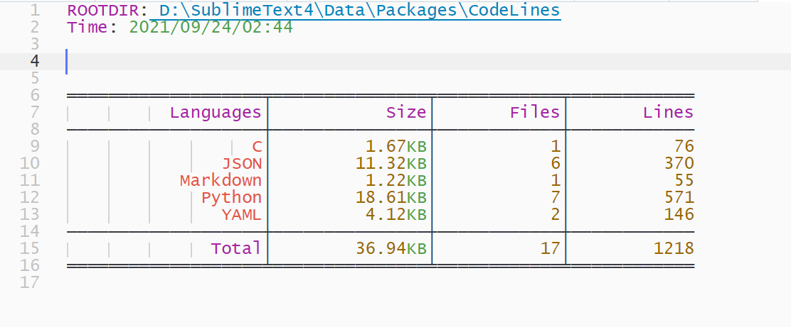
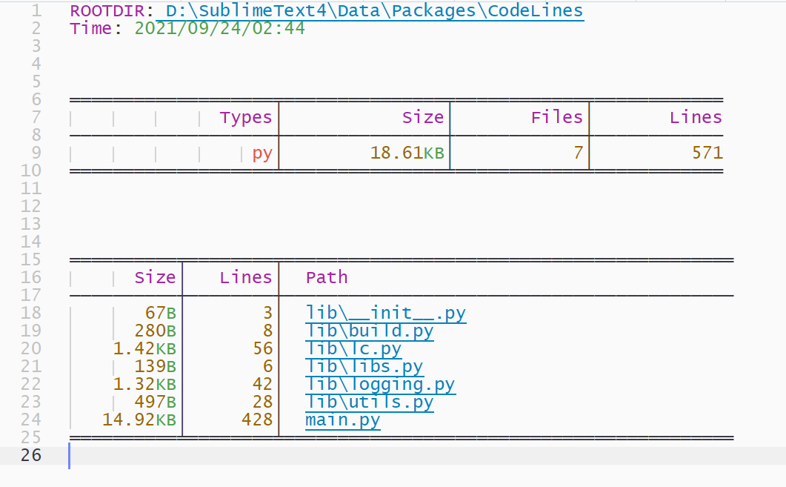
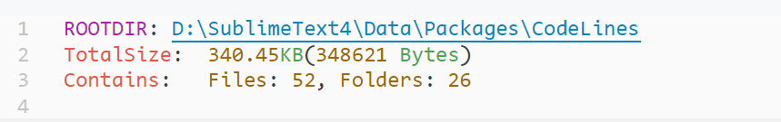

[![License][license-image]](/LICENSE)
[![Downloads][packagecontrol-image]][packagecontrol-link]

# CodeLines

## About

`CodeLines` is a code statistic plugin for **Sublime Text 4**. It provides visual statistics of codes in a directory or a file.


## Installation
Download the repository and unzip it into your packages path of Sublime Text, or direct clone it with the help of `git` tools.

Of course, you can also use `Package Control` to help you if you have installed it before.


## Features overview
- sidebar Menu items
    * Files Size
    * Code Lines
    * Code Lines (with Pattern)

- commands Palette
    * CodeLines: Count
    * CodeLines: Count with Pattern
    * CodeLines: File Size


### Screen shots
1. Overview by languages


2. Details by file types


3. File size



### Pattern specific


## Settings
```json
{
    "encoding": "utf-8",
}
```


## TODO
- [ ] Path matching
- [ ] Initial cursor location
- [ ] Next language/file (align cursor with scope name)
- [ ] Proportions


## [Issue](https://github.com/absop/CodeLines/issues)


[license-image]: https://img.shields.io/badge/license-MIT-blue.svg
[packagecontrol-image]: https://img.shields.io/packagecontrol/dt/CodeLines.svg
[packagecontrol-link]: https://packagecontrol.io/packages/CodeLines
